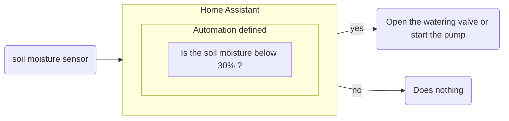



 

### Home Automation

 


Home automation encompasses all the technologies that allow you to automate and remotely control your home's equipment, such as heating, lighting, roller shutters, and security systems, including alarms. It aims to make your daily life simpler, more comfortable, safer, and more energy-efficient. For example, you can program your shutters to open in the morning, turn on the lights when you get home, or lower the heating when you're away.
The word comes from the Latin *domus* (house) and the suffix *-tic* (related to a technique), hence the science of the home.
Today, all of this is often done via a smartphone, a tablet, or through assistants like Alexa or Google Home.
{.text-lg .mb-4}


 

Here's the kind of common definition you'll find when searching online and asking in specialized stores, where they'll sing the praises of the "smart home."
{.text-lg .mb-4}

Let's get straight to the point.
{.text-lg .mb-4}

 

### Tools, Sensors, and Relays

 
Home automation primarily consists of sensors and relays. Their roles range from transmitting environmental data to opening or closing a relay. Communication between the coordinator, in this case a Home Assistant server, and the devices is largely wireless, using several standards. The ones we specifically use are Zigbee, which has the advantage of being composed of small, energy-efficient devices.
{.text-lg .mb-4}
Here are some examples of probes:
{.text-lg .mb-4}

- Temperature probe
- Humidity probe
- Pressure sensor
- Voltage, amperage, and wattage measurement probe
- Gas detection probe
- Infrared probe
- Light intensity (lux) measurement probe
- etc.
{.text-lg .mb-4}

And relays:
{.text-lg .mb-4}

- Electrical switch relay
- Valve control relay
- Variable intensity modulator relay
- Mechanical control relay
- etc.
{.text-lg .mb-4}

To function, these devices require an IT infrastructure and access points, in this case via remote antennas to cover the equipped areas.
{.text-lg .mb-4}

The conductor is the Home Assistant software installed on a mini-PC, which centralizes the data and allows you to set up automation scenarios.
{.text-lg .mb-4}

 

Here is the diagram of an automatic watering system based on soil moisture levels:
{.text-lg .mb-4}

Starting from this base, we can imagine scenarios to refine the automation, for example by adding a timer function so that the watering lasts 20 minutes.
{.text-lg .mb-4}

Other criteria can be integrated into the automation to best customize it to the user's constraints and preferences.
{.text-lg .mb-4}

### Why Choose Home Assistant

Home automation is not a recent phenomenon, and today, many solutions are integrated, leaving users trapped in a closed and limited ecosystem. This leads, over time, to a proliferation of incompatible platforms and devices.
{.text-lg .mb-4}

For example, the surveillance solutions offered by insurance companies or remote-controlled automatic shutter systems are prime examples.
{.text-lg .mb-4}

It is necessary to purchase a specific gateway from each manufacturer, and the use of sensors, relays, and cameras is exclusive to their system.
{.text-lg .mb-4}

This is where "Home Assistant" stands out. It is open-source software designed to integrate as many devices from different manufacturers as possible without the need for proprietary gateways. This allows you to use a wide variety of devices directly from a single software interface that runs on any compatible machine. The software is also free and open source (accessible to everyone).
{.text-lg .mb-4}

Once Home Assistant is installed on a suitable machine (PC-compatible) with a few sensors and relays, it's possible to transform simple objects like a light bulb into more complex systems, such as an automatic lighting system triggered by presence detection, activating in a hallway or when someone is detected outside the house.
{.text-lg .mb-4}

The possibilities are numerous, and new integrations are constantly being added through updates to support new brands and devices. Here is the link to the official website where you can find [the supported integrations](https://www.home-assistant.io/integrations/ "Officially Supported Integrations")
{.text-lg .mb-4}

With several hundred thousand active users worldwide and rapid growth, Home Assistant has established itself as one of the most popular open-source home automation platforms.
{.text-lg .mb-4}

 

### Who is this tool for?

If you are already using proprietary platforms and replacing them is on your agenda, Home Assistant is a smart choice.
{.text-lg .mb-4}

You want to get started with home automation using a solution you understand, that works locally by default, doesn't rely on the cloud, and is resilient to internet outages.
{.text-lg .mb-4}

You want to invest in the future. In a collaborative and scalable software with one of the largest user bases in the sector.
{.text-lg .mb-4}

You no longer want to depend on proprietary platforms from GAFAM companies like Apple HomeKit, Google Home, and Amazon Alexa, which export and use your data on their online servers.
{.text-lg .mb-4}

### What do we offer in this regard?

Through our association, we offer workshops (https://lafermetteverdoyante.com/en/workshops/ "Our workshops") to discover this system and present a practical approach to its daily use.
{.text-lg .mb-4}

