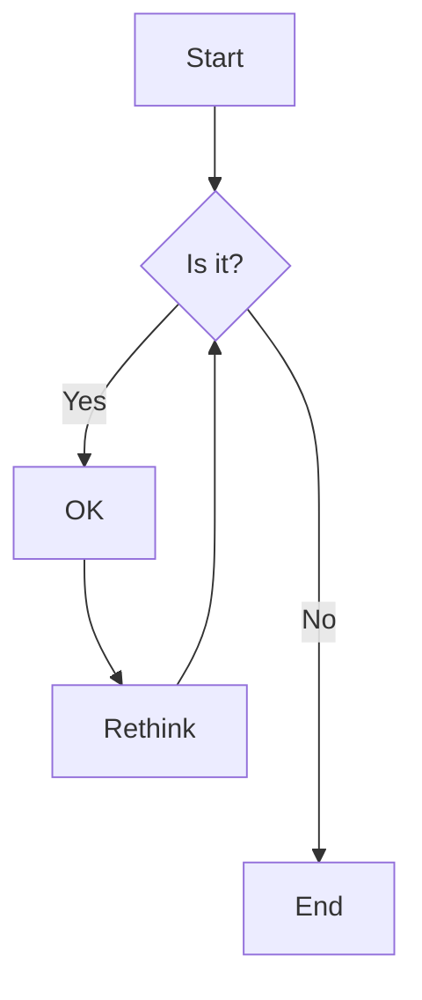



<br>

### Domotique mais Késako ?


La **domotique**, c’est l’ensemble des technologies qui permettent d’automatiser et de contrôler à distance les équipements de votre maison, comme le chauffage, l’éclairage, les volets roulants, les systèmes de sécurité notamment les alarmes.  

Elle vise à **rendre votre quotidien plus simple, plus confortable, plus sûr et plus économe en énergie**. Par exemple, vous pouvez programmer vos volets pour qu’ils s’ouvrent le matin, faire allumer les lumières quand vous rentrez, ou faire baisser le chauffage quand vous êtes absent.  

Le mot vient du latin *domus* (maison) et du suffixe *-tique* (relatif à une technique), donc **la science de la maison**. Aujourd’hui, tout cela se fait souvent via un smartphone, une tablette ou par le biais d'assistant comme Alexa ou Google Home.  


Voici le type de définition commune que l'on va trouver en cherchant sur internet et en se renseignant dans les boutiques spécialisés où l'on va faire l'éloge de la "maison intelligente"

Pour ma part, ce n'est pas sous cet angle que je souhaite aborder ce qu'est la domotique. 

En tant qu'être humain, on cherche depuis toujours le moyen d'intéragir avec notre environnement, pour cela nous développons des capacités, des techniques, nos sens pour comprendre ce qui nous entoure afin d'agir au mieux de nos intérêts ou de celui du milieu dans lequel on vit.
La domotique n'est finalement que la somme des données des différents types de capteurs mis en interrelation pour réaliser des automatisations censés élargir notre champ d'action dans notre quotidien

sont la résultantes des  déployés et    
On entendSur le papier on va nous nous  rendre notre habitat "intelligent" mais en réalité ce n'est pas la meilleure façon d'aborder 
<hr>

La domotique, vue sous un angle profondément humain, peut être comprise comme **une extension de nos sens et de notre volonté** — une matérialisation moderne de notre besoin ancestral d’interagir avec l’environnement pour mieux y vivre. 

Plutôt que de la réduire à une simple « maison intelligente », on peut y voir **un système vivant d’interactions**, où capteurs, automates et réseaux forment un **nouvel organe perceptif collectif**.  Ces capteurs — thermiques, de mouvement, d’humidité, sonores — agissent comme des prolongements de nos yeux, oreilles ou peau, percevant des changements que nous ne remarquerions pas.

En reliant ces données et en les traduisant en actions (allumer une lumière, fermer un volet, ajuster le chauffage), la domotique devient **un langage entre l’humain et son habitat**.  Elle ne remplace pas l’action humaine, mais **l’amplifie**, en permettant de réagir à distance, en anticipant nos besoins ou en adaptant l’espace à nos rythmes. 

C’est donc moins une technologie de confort qu’un **outil d’emprise sur le réel**, au service de notre autonomie, de notre sécurité, ou de notre harmonie avec l’environnement.  Dans cette perspective, la domotique n’est pas une rupture, mais **la suite logique de l’instinct humain qui cherche, depuis toujours, à domestiquer le monde — pas seulement la maison, mais la relation entre soi et le monde.**


### Button



<hr>

### Link

[I'm an inline-style link](https://www.google.com)

[I'm an inline-style link with title](https://www.google.com "Google's Homepage")

[I'm a relative reference to a repository file](../blob/master/LICENSE)

URLs and URLs in angle brackets will automatically get turned into links.
<http://www.example.com> or <http://www.example.com> and sometimes
example.com (but not on Github, for example).

Some text to show that the reference links can follow later.

<hr>

### Paragraph

Lorem ipsum dolor sit amet consectetur adipisicing elit. Quam nihil enim maxime corporis cumque totam aliquid nam sint inventore optio modi neque laborum officiis necessitatibus, facilis placeat pariatur! Voluptatem, sed harum pariatur adipisci voluptates voluptatum cumque, porro sint minima similique magni perferendis fuga! Optio vel ipsum excepturi tempore reiciendis id quidem? Vel in, doloribus debitis nesciunt fugit sequi magnam accusantium modi neque quis, vitae velit, pariatur harum autem a! Velit impedit atque maiores animi possimus asperiores natus repellendus excepturi sint architecto eligendi non, omnis nihil. Facilis, doloremque illum. Fugit optio laborum minus debitis natus illo perspiciatis corporis voluptatum rerum laboriosam.

<hr>

### Ordered List

1. List item
2. List item
3. List item
4. List item
5. List item

<hr>

### Unordered List

- List item
- List item
- List item
- List item
- List item

<hr>

### Notice


This is a simple note.



This is a simple quote.



This is a simple tip.



This is a simple info.



This is a simple warning.


<hr>

### Tab




#### Hey There, I am a tab

Lorem ipsum dolor sit amet, consetetur sadipscing elitr, sed diam nonumy eirmod tempor invidunt ut labore et dolore magna aliquyam erat, sed diam voluptua. At vero eos et accusam et justo duo dolores et ea rebum. Stet clita kasd gubergren, no sea takimata sanctus est Lorem ipsum dolor sit amet.





#### I wanna talk about the assassination attempt

Lorem ipsum dolor sit amet, consetetur sadipscing elitr, sed diam nonumy eirmod tempor invidunt ut labore et dolore magna aliquyam erat, sed diam voluptua. At vero eos et accusam et justo duo dolores et ea rebum. Stet clita kasd gubergren, no sea takimata sanctus est Lorem ipsum dolor sit amet.

Lorem ipsum dolor sit amet, consetetur sadipscing elitr, sed diam nonumy eirmod tempor invidunt ut labore et dolore magna aliquyam erat, sed diam voluptua. At vero eos et accusam et justo duo dolores et ea rebum. Stet clita kasd gubergren, no sea takimata sanctus est Lorem ipsum dolor sit amet.





#### We know you’re dealing in stolen ore

Lorem ipsum dolor sit amet, consetetur sadipscing elitr, sed diam nonumy eirmod tempor invidunt ut labore et dolore magna aliquyam erat, sed diam voluptua. At vero eos et accusam et justo duo dolores et ea rebum. Stet clita kasd gubergren, no sea takimata sanctus est Lorem ipsum dolor sit amet.

Lorem ipsum dolor sit amet, consetetur sadipscing elitr, sed diam nonumy eirmod tempor invidunt ut labore et dolore magna aliquyam erat, sed diam voluptua. At vero eos et accusam et justo duo




<hr>

### Accordions



- Lorem ipsum dolor sit amet consectetur adipisicing elit.
- Lorem ipsum dolor sit amet consectetur adipisicing elit.
- Lorem ipsum dolor sit amet consectetur





- Lorem ipsum dolor sit amet consectetur adipisicing elit.
- Lorem ipsum dolor sit amet consectetur adipisicing elit.
- Lorem ipsum dolor sit amet consectetur





- Lorem ipsum dolor sit amet consectetur adipisicing elit.
- Lorem ipsum dolor sit amet consectetur adipisicing elit.
- Lorem ipsum dolor sit amet consectetur



<hr>

### Code and Syntax Highlighting

This is an `Inline code` sample.

```javascript
var s = "JavaScript syntax highlighting";
alert(s);
```

```python
s = "Python syntax highlighting"
print s
```

```c  { linenos=true }
#include <stdio.h>

int main(void)
{
    printf("hello, world\n");
    return 0;
}
```



<hr>

### Blockquote

> Did you come here for something in particular or just general Riker-bashing? And blowing into maximum warp speed, you appeared for an instant to be in two places at once.

<hr>

### Tables

| Tables        |      Are      |  Cool |
| ------------- | :-----------: | ----: |
| col 3 is      | right-aligned | $1600 |
| col 2 is      |   centered    |   $12 |
| zebra stripes |   are neat    |    $1 |

<hr>

### Image



<hr>

### Gallery



<hr>

### Slider



<hr>

### Youtube video



<hr>

### Custom video


