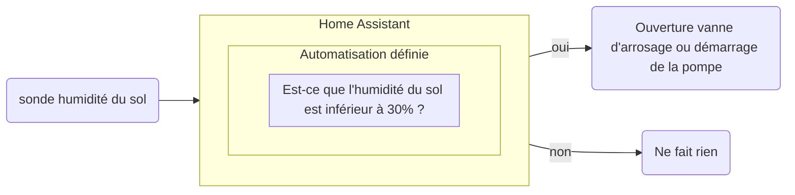



 

### Domotique

 


C’est l’ensemble des technologies qui permettent d’automatiser et de contrôler à distance les équipements de votre maison, comme le chauffage, l’éclairage, les volets roulants, les systèmes de sécurité notamment les alarmes.  
Elle vise à rendre votre quotidien plus simple, plus confortable, plus sûr et plus économe en énergie. Par exemple, vous pouvez programmer vos volets pour qu’ils s’ouvrent le matin, faire allumer les lumières quand vous rentrez, ou faire baisser le chauffage quand vous êtes absent.  
Le mot vient du latin *domus* (maison) et du suffixe *-tique* (relatif à une technique), donc la science de la maison.
Aujourd’hui, tout cela se fait souvent via un smartphone, une tablette ou par le biais d'assistant comme Alexa ou Google Home.
{.text-lg .mb-4}  


 

Voici le type de définition commune que l'on va trouver en cherchant sur internet et en se renseignant dans les boutiques spécialisées où l'on va faire l'éloge de la "maison intelligente"
{.text-lg .mb-4}

Nous allons directement rentrer dans le vif du sujet.
{.text-lg .mb-4}

 

### Les outils, des capteurs et des relais

 

La domotique consiste avant tout en des capteurs et des relais. Leurs rôles varient de la transmission de données environnementales à l'action d'ouvrir ou de fermer un relais. Les communications entre le coordinateur, ici on parle d'un serveur Home Assistant, et les appareils se font en grande partie avec une connexion sans fil qui peut se faire selon plusieurs normes. Ceux que nous utilisons spécifiquement sont à la norme "Zigbee", qui présente l'avantage d'être composée d'appareils de petite taille et très peu énergivores.
{.text-lg .mb-4}

Voici quelques exemples de sondes :
{.text-lg .mb-4}
- sonde de température 
- sonde d'humidité
- capteur de pression
- sonde de mesure de Voltage - Ampérage - et Watts
- sonde de détection de gaz 
- sonde infrarouge
- sonde de mesure d'intensité lumineuse (lux)
- etc.
{.text-lg .mb-4}

Et de relais :
{.text-lg .mb-4}
- relais type interrupteur électrique
- relais controleur de vanne
- relais de type modulateur variateur d'intensité
- relais de contrôle mécanique
- etc.
{.text-lg .mb-4}

Pour fonctionner, ces appareils ont besoin ont besoin d'une infrastructure informatique et de points d'accès, ici via des antennes qui sont déportées pour couvrir les zones équipées.
{.text-lg .mb-4}

Le chef d'orchestre est le logiciel Home Assistant installé sur un mini-PC qui centralise les données et permet de mettre en place des scénarios d'automatisation
{.text-lg .mb-4}

 

Voici le schéma d'un arrosage automatique basé sur le taux d'humidité du sol :
{.text-lg .mb-4}

Partant de cette base, on peut imaginer des scénarios pour affiner l'automatisation, par exemple en ajoutant une fonction minuteur pour que l'arrosage dure 20min.
{.text-lg .mb-4}

D'autres critères peuvent être intégrés dans l'automatisation pour la personnaliser au mieux des contraintes et souhaits de l'utilisateur.
{.text-lg .mb-4}

### Pourquoi le choix de Home Assistant

Le développement de la domotique n'est pas récent et aujourd'hui les offres sont bien souvent intégrées et on se retrouve dès lors piégé dans un écosystème fermé et limité. Ce qui amène dans le temps à une multiplication de plateformes et d'équipements incompatibles entre eux.
{.text-lg .mb-4}
Par exemple, les solutions de surveillance proposées par les assurances ou encore les systèmes de volets automatiques télécommandés sont emblématiques.
{.text-lg .mb-4}
Il est nécessaire d'acquérir une passerelle spécifique à chaque constructeur et l'utilisation des capteurs, relais  et caméras est exclusive à leur système.
{.text-lg .mb-4}
C'est là où se démarque "Home Assistant", qui est un logiciel libre ayant pour objectifs d'intégrer un maximum de dispositifs d'équipementiers différents sans la contrainte de passer par des passerelles "propriétaires". Ainsi il est possible d'utiliser une grande variété de dispositifs directement depuis une seule interface logiciel qui fonctionne sur la machine compatible de son choix. Le logiciel est de plus gratuit et à code ouvert (accessible à tous).
{.text-lg .mb-4} 
Une fois Home Assistant installé sur une machine adéquate (PC-compatible) avec quelques capteurs et relais il est possible de transformer des objets simples comme une ampoule en système plus complexe comme par exemple un dispositif d'allumage automatique par la détection de présence, s'activant pour un couloir ou lors de la détection d'une personne à l'extérieur de la maison.  
{.text-lg .mb-4}
Les possibilités sont très nombreuses et de nouvelles intégrations sont constamment proposées via des mises à jour afin de prendre en charge de nouvelles marques et appareils. Voici le lien vers le site officiel où se trouve [les intégrations compatibles](https://www.home-assistant.io/integrations/ "Intégrations Officielement prise en charge") 
{.text-lg .mb-4}
Avec plusieurs centaines de milliers d’utilisateurs actifs dans le monde, et une croissance rapide, Home Assistant s’impose comme l’une des plateformes open source les plus populaires en domotique.
{.text-lg .mb-4}

 

### À qui est destiné cet outil ?

Si vous utilisez déjà des plateformes "propriétaire" et que leur remplacement est sur votre feuille de route, l'option Home Assistant est un choix judicieux.
{.text-lg .mb-4} 
Vous souhaitez démarrer en domotique avec une solution dont vous maîtrisez l'usage, qui fonctionne de base localement, ne dépend d'aucun cloud et est résiliente face aux pannes internet.
{.text-lg .mb-4} 
Vous avez envie de miser sur l'avenir. Sur un logiciel participatif et évolutif ayant une des plus grande base utilisateurs dans ce secteur.
{.text-lg .mb-4} 
Vous souhaitez ne plus dépendre des plateformes propriétaires des GAFAM comme Apple HomeKit, Google Home et Amazon Alexa qui exportent et exploitent vos données sur leurs serveurs en lignes.
{.text-lg .mb-4} 

### Que proposons nous à ce sujet ?

Nous proposons dans le cadre de notre association [des ateliers](https://lafermetteverdoyante.com/fr/ateliers/ "Nos ateliers") permettant de découvrir ce système et de présenter une approche pratique de son utilisation au quotidien.
{.text-lg .mb-4} 
