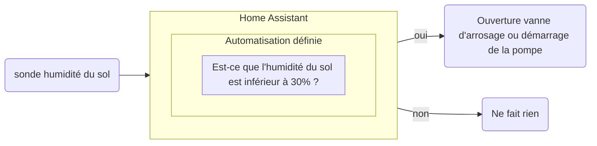



 

### Domotique

 


C’est l’ensemble des technologies qui permettent d’automatiser et de contrôler à distance les équipements de votre maison, comme le chauffage, l’éclairage, les volets roulants, les systèmes de sécurité notamment les alarmes.  
Elle vise à rendre votre quotidien plus simple, plus confortable, plus sûr et plus économe en énergie. Par exemple, vous pouvez programmer vos volets pour qu’ils s’ouvrent le matin, faire allumer les lumières quand vous rentrez, ou faire baisser le chauffage quand vous êtes absent.  
Le mot vient du latin *domus* (maison) et du suffixe *-tique* (relatif à une technique), donc la science de la maison.
Aujourd’hui, tout cela se fait souvent via un smartphone, une tablette ou par le biais d'assistant comme Alexa ou Google Home.
{.text-lg .mb-4}  


 

Voici le type de définition commune que l'on va trouver en cherchant sur internet et en se renseignant dans les boutiques spécialisés où l'on va faire l'éloge de la "maison intelligente"
{.text-lg .mb-4}

Nous allons directement rentrer dans le vif du sujet.
{.text-lg .mb-4}

 

### Les outils, des capteurs et des relais

 

En effet, la domotique consiste avant tout en des capteurs et des relais de tailles réduites et très peu énergivore pouvant recueillir des données et contrôler certains paramétres, de manière autonome avec des piles bien souvent et surtout avec une connection sans fil à basse consommation (particuliérement la norme Zigbee) :
{.text-lg .mb-4}

Voici quelques exemples de sondes :
{.text-lg .mb-4}
- sonde de température 
- sonde d'humidité
- capteur de pression
- sonde de mesure de voltage - ampérage - consommation électrique en Watts
- sonde de détection de gaz 
- sonde infrarouge
- sonde de mesure d'intensité lumineuse (lux)
- etc.
{.text-lg .mb-4}

Et de relais :
{.text-lg .mb-4}

- relais type interrupteur électrique
- relais controleur de vanne
- relais de type modulateur variateur d'intensité
- relais de contrôle mécanique
- etc.
{.text-lg .mb-4}

Ces appareils pour fonctionner ont besoin d'une infrastructure informatique et de points d'accès (sous forme d'antennes pouvant être déportées pour couvrir les zones équipées)
{.text-lg .mb-4}

Le chef d'orchestre est le logiciel Home Assistant qui centralise les données et permets de les mettres en relation dans des scénarios d'automatisation
{.text-lg .mb-4}

 

Voici un schéma simple d'un arrosage automatique basé sur le taux d'humidité du sol :
{.text-lg .mb-4}

Partant de cette base on peut imaginer des scénarios pour affiner l'automatisation, par exemple en rajoutant une fonction minuteur pour que l'arrosage dure 20min.
{.text-lg .mb-4}

À cela on peut ajouter des conditions à partir d'autres capteurs physiques ou de prévisions météos d'internet pour par exemple éviter d'arroser si dans les prochaines douze heures une grosse averse est prévue.  
{.text-lg .mb-4}

### Pourquoi le choix de Home Assistant

Le développement de la domotique n'est pas récent. De nombreuses marques proposent des solutions intégrées dès lors que l'on choisit d'investir dans leurs produits.
{.text-lg .mb-4}
Par exemple, les solutions de surveillance proposées par les assurances ou encore les systèmes de volets automatiques télécommandé sont emblématiques.
{.text-lg .mb-4}
Il est nécessaire d'acquérir une passerelle spécifique à chaque constructeur et l'utilisation des capteurs, relais  et caméras est exclusive à leur système.
{.text-lg .mb-4}
Home Assistant est une plateforme libre ayant pour objectifs d'intégrer un maximum de dispositifs sans devoir obligatoirement utiliser les passerelles propriétaire. Ainsi il est possible d'utiliser une grande variétés de dispositif directement depuis une seule interface qui en plus d'être gratuit est à code ouvert.
{.text-lg .mb-4} 
Une fois la base logiciel de Home Assistant installé sur une machine compatible (PC, Raspberry ou serveur) avec quelques capteurs et relais il est possible de transformer des objets simples comme une ampoule en système plus complexe comme un allumage automatique par la détection de présence. Ce même capteur de présence peut-être utilisé à son tour dans d'autres scénarios. 
{.text-lg .mb-4}
Les possibilitées sont très nombreuses et elles ne cessent de s'agrandir au fur et à mesure  du développement de ce logiciel.
{.text-lg .mb-4}

 

### Usage avancé : la base de données

 

Il y a des données qui sont très intérressantes à suivre dans le temps pour permettre une analyse plus fine ensuite. En particulier les données météorologiques quand on dispose d'une station météo sur son lieu.
{.text-lg .mb-4}
Ici nous procédons depuis peu par ce biais à la collecte systèmatique des données climatiques du lieu, notamment :
{.text-lg .mb-4}
- les précipations en mm et leurs intensitées,
- la vitesse et sens du vent en km/h ainsi que la vitesse en rafale rafales
- les témpératures extérieur et dans la serre bioclimatique
- le taux d'humidité et le point de rosée
- la production photovoltaïque 
- les variations de pressions atmosphériques
- etc .
{.text-lg .mb-4}
Présentement nous testons la possibilité d'exporter certaines données depuis Home Assistant vers une base de donnée, en l'occurence victoriametrics, qui se charge de les collecter et les conserver sur le (très) long terme pour réaliser un suivi de la situation. 
{.text-lg .mb-4}
De plus, d'autres outils comme Graphana permettent ensuite une mise en forme graphique pour une approche plus visuel.
{.text-lg .mb-4}



### À qui est destiné cet outil ?

Si vous utilisez déjà des plateformes "propriétaires" et que leur remplacement est sur votre fiche de route, l'option Home Assistant est à sérieusement envisagée.
{.text-lg .mb-4} 
Vous souhaitez démarrer en domotique et augmenter vos possibilitées au niveau des équipements et rester libre de vos choix.
{.text-lg .mb-4} 
Vous avez envie de miser sur l'avenir et sur un logiciel évolutif ayant la plus grande base d'utilisateurs actuellement.
{.text-lg .mb-4} 

### Que proposons nous à ce sujet ?

Nous proposons dans le cadre de notre associations [des ateliers](https://lafermetteverdoyante.com/fr/ateliers/ "Nos ateliers") permettant de découvrir localement ce système.
{.text-lg .mb-4} 

